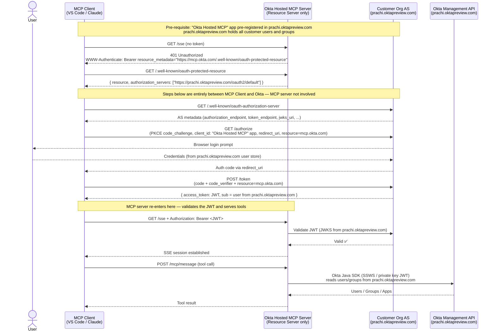
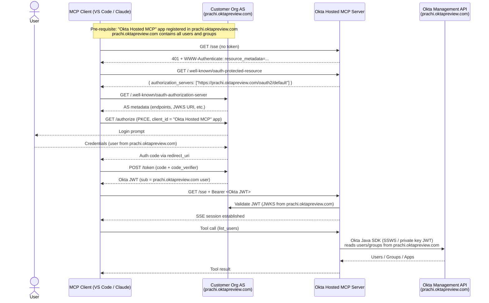

# Authorization POC with OIDC Support

> **Jira:** OKTA-1145109  
> **Branch:** `feature/oidc-auth-poc`  
> **Author:** Prachi Pandey  
> **Status:** ✅ Complete

---

## 0. Background

Okta already offers a [self-hosted MCP server](https://github.com/okta/okta-mcp-server) with tools
covering users, groups, applications, policies, and logs. Customers run this themselves — they
download it, plug in their own SSWS API key, and host it on their own infrastructure.

**Okta Hosted MCP** takes everything the self-hosted server supports and makes it a managed offering:
- Okta runs and maintains the server — customers don't worry about hosting, scaling, or updates
- Supports all capabilities of the self-hosted server, plus more over time
- The immediate plan is the **BYO-LLM model**: customers bring their own AI client (VS Code, Claude, Cursor, etc.) and connect it to `mcp.okta.com`
- Future phases may extend to a Chatbot or other advanced offerings

The key difference from self-hosted is **who holds the credential**:
- Self-hosted: customer generates a static SSWS API key and puts it in env vars on their server
- Hosted: the customer's **OAuth JWT is the credential** — short-lived, per-user, Okta-issued, no static secret

This doc covers the **authorization POC** for the hosted model — specifically, how MCP clients
authenticate to the Okta Hosted MCP server and how the server validates those credentials.

---

## 1. Components

> **Design principle:** The MCP server is a **pure resource server**. It plays no role
> in the OAuth flow. Auth happens entirely between the MCP client and Okta directly.
> The MCP server only needs to know how to point clients to Okta and how to validate
> the JWT they bring back.

### 1.1 `ProtectedResourceMetadataController`
Implements RFC 9728. Serves `GET /.well-known/oauth-protected-resource`.

```json
{
  "resource": "https://mcp.okta.com/sse",
  "authorization_servers": ["https://customer-org.okta.com/oauth2/default"],
  "scopes_supported": ["openid", "profile", "email"],
  "bearer_methods_supported": ["header"]
}
```

`authorization_servers` points **directly at the customer's Okta AS**. The MCP client
discovers Okta's real endpoints from there and handles the full OAuth flow itself.

---

### 1.2 `SecurityConfig`
- Returns `401` with `WWW-Authenticate: Bearer resource_metadata="https://mcp.okta.com/.well-known/oauth-protected-resource"` for unauthenticated requests
- Validates incoming JWTs using Spring `oauth2ResourceServer()` against Okta's JWKS
- Permits `/.well-known/**` without auth; everything else requires a valid Bearer token

---

### 1.3 `OktaClientProvider`
Uses a separate SSWS API token (or private key JWT) to call the Okta Management API.
The user's JWT proves **identity**; the SSWS/PKJ credential provides **API access**.
These are two independent credential systems.

---

## 2. Target Authorization Flow

The MCP server is involved in **only two steps**: issuing the 401 challenge and validating the JWT.
Everything in between is between the MCP client and Okta directly.



---

## 4. Authorization Integration Models for Okta Hosted MCP

Both models must be supported — they serve different customer personas.
The goal is to document each clearly, identify any technical blockers per step,
and bring to the architecture forum for alignment. Both options keep the
Okta Hosted MCP server as a **pure resource server** in all cases.

---

### Option 1 — Direct OIDC / Pre-registered Client

The MCP client uses a `client_id` that is **pre-registered** in the customer's Okta org
as a prerequisite — there is no dynamic client registration. The client does a PKCE flow
directly with Okta, obtains a JWT, and presents it to the Okta Hosted MCP server on
every request.

**Used by:** Stripe `mcp.stripe.com`, this POC, VS Code Copilot

**Target persona:** BYO-LLM — a human user authorizing their own AI agent



**Technical considerations:**
- `client_id` must be pre-registered in the customer's Okta org before any MCP client can connect — requires a one-time IT/admin step per org
- The MCP client must be configured with the `client_id` and know the Okta org URL as a pre-requisite
- MCP spec §4.2 requires the client to support both `WWW-Authenticate` header parsing and well-known URI fallback probing — VS Code Copilot supports this ✅
- The `resource` parameter (RFC 8707) must be sent in both `/authorize` and `/token` requests for proper audience binding on the issued JWT
- Token refresh is entirely the client's responsibility — the MCP server is stateless

**Technical blockers / open questions:**
- ⚠️ **Loopback redirect_uri mismatch** — VS Code uses `http://127.0.0.1:<random_port>/` as `redirect_uri` on every PKCE flow (tracked below). Okta Custom AS requires exact URI match; RFC 8252 §7.3 loopback wildcard is not supported.
- ⚠️ How does the customer get the `client_id` into the MCP client? Needs a documented setup flow (manual config, SDK, or MCP client metadata document)
- ⚠️ Audience validation: does Okta enforce `aud` claim matching `resource` parameter? Needs verification against Okta Custom AS behaviour

#### Loopback `redirect_uri` — what VS Code actually does and all known solutions

**Root cause:** VS Code's MCP OAuth implementation (confirmed in [VS Code source and GitHub issues](https://github.com/microsoft/vscode/issues/278512)):
- Tries to bind on **port 33418** first (`DEFAULT_AUTH_FLOW_PORT`); uses a **random ephemeral port** if 33418 is taken
- During Dynamic Client Registration (DCR) it registers: `https://vscode.dev/redirect`, `https://insiders.vscode.dev/redirect`, `http://127.0.0.1/`, `http://127.0.0.1:33418/`
- VS Code's lead (@TylerLeonhardt) [closed this as "not planned"](https://github.com/microsoft/vscode/issues/278512#issuecomment-2526497440) — VS Code considers it correct per RFC 8252 §7.3: *"The authorization server MUST allow any port to be specified at the time of the request for loopback IP redirect URIs"*
- Since VS Code 1.103.0 (July 2025): when DCR fails VS Code prompts the user to enter a pre-registered `client_id` and `client_secret` — **but still uses the random loopback port as `redirect_uri`** in the auth code flow

**Confirmed solutions (with trade-offs):**

| # | Approach | How it works | Works in VS Code | Complexity | Status in POC |
|---|---|---|---|---|---|
| **A** | **MCP Server AS Proxy** | `/.well-known/oauth-protected-resource` returns the MCP server's own AS URL (not Okta directly). MCP server's `/authorize` proxy accepts VS Code's random `redirect_uri`, stores it in a state map, substitutes a fixed registered callback (`https://mcp.okta.com/oauth2/callback`) when forwarding to Okta. On callback, relays the code back to VS Code's original loopback. | ✅ Works (default DCR flow + pre-registered) | High | ✅ Partially implemented (`OAuthProxyController.java`) |
| **B** | **Register `http://127.0.0.1:33418/` in Okta** | Register `http://127.0.0.1:33418` as a redirect URI in the Okta app config. Works as long as VS Code uses port 33418, which it does by default when the port is free. | ✅ Works when port 33418 is free | None | ❌ Not tried |
| **C** | **VS Code pre-registered `client_id` (UI prompt)** | VS Code 1.103+ prompts for `client_id`/`client_secret` when DCR fails. Register a fixed `client_id` in Okta. BUT VS Code still sends a random loopback port as `redirect_uri` — so Okta still rejects unless combined with Option A or B. | ⚠️ Partial — only works combined with A or B | Low | ❌ Not tried |
| **D** | **MCP Server exposes DCR endpoint** (Stripe model) | MCP server implements RFC 7591 DCR. VS Code registers via DCR. DCR response includes `https://vscode.dev/redirect` and `http://127.0.0.1/` (any port). MCP proxy AS accepts any loopback port (doesn't validate exact port). Stripe does exactly this at `mcp.stripe.com/register`. | ✅ Works (VS Code uses DCR by default) | High | ❌ Not tried |
| **E** | **Use Okta Native App type** | Create the Okta app as **Native Application** type (OIDC). Okta OIE Native apps accept `http://127.0.0.1` loopback URIs without port-exact matching. Requires `application_type=native` in DCR or admin app configuration. | ✅ Likely works — needs verification | Low | ❌ Not verified |
| **F** | **Static token in `mcp.json`** | Use `"headers": {"Authorization": "Bearer ${input:okta-token}"}` in `mcp.json`. User pastes a token manually. No OAuth flow. | ✅ Works (dev/testing only) | None | ✅ Works today |

**Recommended path:**
- **Short term**: Try **Option B** first — register `http://127.0.0.1:33418` in Okta and test. Zero code change. Fails gracefully only when that port is in use (single VS Code instance on the machine means it's almost always free).
- **Medium term**: Verify **Option E** — if Okta Native App type supports loopback wildcard, this is the cleanest solution for production with no proxy complexity.
- **Production**: Implement **Option A** (proxy AS, Stripe model) for full robustness — handles random ports, supports DCR, requires no user action.

**POC Acceptance Criteria:**

| # | What to test | Pass condition |
|---|---|---|
| 1 | **Option B: register port 33418** — add `http://127.0.0.1:33418` to Sign-in redirect URIs in `prachi.oktapreview.com`; run VS Code MCP connect with no other VS Code instances running | VS Code PKCE flow completes; SSE session established with valid JWT; no manual user action beyond browser login |
| 2 | **Option E: Native App type loopback** — change app type to Native Application; add `http://127.0.0.1` (no port) to redirect URIs; verify Okta accepts a request with `redirect_uri=http://127.0.0.1:33418` without error | Okta issues auth code; token exchange succeeds; MCP session established |
| 3 | **Option A: proxy callback relay** — configure `/.well-known/oauth-authorization-server` to return MCP server proxy endpoints; register `https://mcp.okta.com/oauth2/callback` in Okta; run VS Code flow with port 33418 intentionally blocked | Auth code flows through MCP proxy callback; VS Code receives code on its random port; token exchange succeeds |
| 4 | **`aud` claim binding** — send `resource=http://127.0.0.1:8081/sse` in `/authorize` and `/token`; decode the returned JWT | JWT `aud` claim contains the resource URI; Spring Security `oauth2ResourceServer()` accepts it without extra config |
| 5 | **Token refresh** — let the access token expire; observe VS Code use the refresh token automatically | MCP server continues to accept the refreshed token; no re-login prompt for the user |

---

### Option 2 — XAA (Cross App Access, Intra-Org via OIN)

The **Okta Hosted MCP server is published as an OIN application**. When a customer wants to use
it, they add it to their Okta org from the OIN catalogue — just like adding any other SaaS app.
This means both the **customer's existing app** (the MCP client / service account app) and the
**"Okta Hosted MCP" OIN app** reside in the **same customer org** (`prachi.oktapreview.com`).

XAA (Cross-App Access) is configured **intra-org** between these two apps. The customer's app
exchanges its existing token for a token scoped to the "Okta Hosted MCP" OIN app — no second
Okta org is involved, no cross-org federation, no separate trust configuration between orgs.

**Used by:** Enterprise customers who onboard the MCP server via the OIN catalogue and need
headless, policy-governed MCP access from their own apps or autonomous agents.

**Target persona:** Enterprise IT-managed app or autonomous AI agent running in the customer's
own infrastructure — no human browser login in the loop.

```mermaid
sequenceDiagram
    actor IT as IT Admin / Customer
    participant App as Customer App (MCP Client)<br/>prachi.oktapreview.com
    participant OktaAS as Customer Org AS<br/>prachi.oktapreview.com
    participant MCPApp as "Okta Hosted MCP" OIN App<br/>prachi.oktapreview.com
    participant MCP as Okta Hosted MCP Server<br/>(hosted by Okta)
    participant OktaMgmt as Okta Management API<br/>prachi.oktapreview.com

    Note over IT,MCPApp: Pre-requisite: IT admin adds "Okta Hosted MCP" from OIN catalogue to prachi.oktapreview.com<br/>IT configures an XAA grant from the customer app to the OIN MCP app (intra-org)

    App->>OktaAS: Authenticate (client credentials or existing user session)
    OktaAS-->>App: Access token issued by prachi.oktapreview.com<br/>(scoped to customer app)

    App->>OktaAS: POST /token — token exchange (RFC 8693)<br/>grant_type=urn:ietf:params:oauth:grant-type:token-exchange<br/>subject_token=&lt;customer app token&gt;<br/>audience=&lt;Okta Hosted MCP OIN app client_id&gt;
    OktaAS->>MCPApp: Validate intra-org XAA grant (same org)
    MCPApp-->>OktaAS: Grant confirmed
    OktaAS-->>App: Exchanged access token<br/>(aud = Okta Hosted MCP OIN app, iss = prachi.oktapreview.com)

    App->>MCP: POST /sse + Bearer &lt;exchanged token&gt;
    MCP->>OktaAS: Validate token (JWKS from prachi.oktapreview.com)
    OktaAS-->>MCP: Valid ✅
    MCP-->>App: 200 + mcp-session-id (session established)

    App->>MCP: POST /sse + mcp-session-id (tool call)
    MCP->>OktaMgmt: Okta Java SDK (SSWS / private key JWT)<br/>reads users/groups from prachi.oktapreview.com
    OktaMgmt-->>MCP: Users / Groups / Apps
    MCP-->>App: Tool result
```

**Technical considerations:**
- **Single org:** both the customer app and the "Okta Hosted MCP" OIN app live in `prachi.oktapreview.com` — no second org, no cross-org federation
- **OIN onboarding:** the customer discovers and adds the "Okta Hosted MCP" app from the Okta Integration Network catalogue, the same way they add any SaaS app — standard IT admin flow
- **XAA intra-org:** the XAA grant is configured between two apps within the same org; this avoids the cross-org token exchange complexity and is a supported intra-org flow
- **Token exchange (RFC 8693):** the customer app exchanges its existing token (`subject_token`) for a token scoped to the OIN MCP app (`audience = OIN app client_id`); the resulting token is still issued by `prachi.oktapreview.com`
- **MCP server validates against customer org JWKS:** since the exchanged token is issued by `prachi.oktapreview.com`, the MCP server validates it against that org's JWKS — same issuer as Option 1, simplifying multi-tenant token validation
- **Okta Management API calls still target the same org:** the token's `iss` and any embedded org claim both point to `prachi.oktapreview.com`, so the Java SDK naturally reads data from the right org
- **No user browser login required:** suitable for headless service accounts and autonomous agents
- **Per-user identity propagation:** if a user context is available, include `actor_token` (user token from the same org) in the token exchange; the resulting JWT carries an `act.sub` claim for audit trail

**Technical blockers / open questions:**
- ⚠️ Does the OIN app framework support an `audience` parameter that lets the customer app target it in a token exchange? Needs verification against Okta intra-org XAA configuration options
- ⚠️ How does the Okta Hosted MCP server know which customer org to route Management API calls to? With intra-org XAA the `iss` is always the customer org, so it can be extracted directly from the JWT — this is cleaner than the cross-org design
- ⚠️ What app type should the OIN listing use (Service app, API Services app, Web app)? Needs architecture decision to determine which grant types are supported
- ⚠️ Customer admin setup: how many steps are needed to add the OIN app, configure the XAA grant, and wire up the customer app? Target is a documented flow completable without Okta engineering involvement

**POC Acceptance Criteria:**

| # | What to test | Pass condition |
|---|---|---|
| 1 | **Intra-org token exchange** — register an "Okta Hosted MCP" app in `prachi.oktapreview.com`; configure intra-org XAA grant from a customer service app; POST `grant_type=urn:ietf:params:oauth:grant-type:token-exchange` with `subject_token` from the customer app and `audience` = OIN app client_id | `prachi.oktapreview.com` returns a valid JWT with `aud` = OIN app client_id; no error response |
| 2 | **JWT validation on MCP server** — configure `issuer-uri` to `prachi.oktapreview.com/oauth2/default`; present the exchanged token to `POST /sse` | MCP server returns `200 + mcp-session-id`; JWKS fetch from `prachi.oktapreview.com` succeeds |
| 3 | **Management API routing** — after session established, invoke `list_users` tool | Tool returns users from `prachi.oktapreview.com`; org resolved from JWT `iss` claim without extra config |
| 4 | **Per-user identity via `actor_token`** — include `actor_token` (a user session token from `prachi.oktapreview.com`) in the token exchange request | Exchanged JWT contains `act.sub` = user's sub from `prachi.oktapreview.com`; audit log shows per-user attribution |
| 5 | **IT admin setup walkthrough** — add OIN app, configure XAA grant, exchange token, connect headless client | All steps completable by customer org admin in ≤10 steps; documented runbook |

### Comparison

> **Design principle:** The Okta Hosted MCP server is a **pure resource server** in both options —
> it validates incoming tokens and serves tools. It does not issue tokens or participate in
> the OAuth flow beyond token validation.

**Option 1 (Direct OIDC)** covers the BYO-LLM persona — a human developer or knowledge worker
who brings their own AI client (VS Code Copilot, Claude Desktop, Cursor) and connects it to
the Okta Hosted MCP server. The customer's Okta org (`prachi.oktapreview.com`) is the single
source of truth for both identity and data: users and groups live there, the "Okta Hosted MCP"
app is pre-registered there, and tokens are issued from there. The MCP client does a standard
PKCE flow directly with that org, receives a short-lived JWT, and presents it on every request.
The MCP server validates the JWT against the org's JWKS and then calls the Okta Java SDK to
serve the tool result. The primary unresolved blocker is the random loopback port that desktop
MCP clients use as a `redirect_uri` — Okta Custom AS does not support RFC 8252's loopback
wildcard matching, so a proxy callback on the MCP server is required as a workaround.

**Option 2 (XAA — Intra-Org via OIN)** covers the enterprise IT-managed or autonomous agent
persona — a customer's own application that needs headless, policy-governed access to Okta Hosted
MCP tools with no browser-based login. The **"Okta Hosted MCP" server is published as an OIN app**.
The customer adds it to their org from the OIN catalogue, and configures an **intra-org XAA grant**
from their existing app to the OIN MCP app. Both apps live in the **same customer org**
(`prachi.oktapreview.com`) — there is no second Okta org and no cross-org federation. The customer
app exchanges its existing token for a token scoped to the OIN MCP app using RFC 8693 token
exchange; the resulting token is still issued by `prachi.oktapreview.com`, so the MCP server
validates it against the same org's JWKS and routes Management API calls back to the same org
without any extra configuration. The primary open questions are around OIN app type, XAA grant
configuration UX, and whether intra-org token exchange supports the required `audience` parameter.

**Both options are needed.** Option 1 serves individual users who want to connect a personal AI
client to their org's Okta data — this is the core BYO-LLM use case and the one with the widest
immediate audience. Option 2 serves enterprise automation scenarios where a line-of-business
application or autonomous agent needs headless, policy-governed access to Okta tools without any
human in the loop. These are complementary personas, not competing designs, and the same MCP
server can support both simultaneously — distinguished by the token shape (user sub vs. app
client credentials) and grant flow. The architecture forum decision should determine which option
to ship first and what the customer onboarding experience looks like for each.

| | Option 1 (Direct OIDC) | Option 2 (XAA — Intra-Org via OIN) |
|---|---|---|
| **Customer org** | `prachi.oktapreview.com` | `prachi.oktapreview.com` |
| **Hosting org / second org** | N/A | N/A — single org only |
| **MCP server distributed as** | Pre-registered app in customer org | **OIN app** added from catalogue |
| **MCP client app** | "Okta Hosted MCP" app in `prachi.oktapreview.com` | Customer's existing app in `prachi.oktapreview.com` |
| **OIN MCP app** | Not applicable | "Okta Hosted MCP" OIN app in `prachi.oktapreview.com` |
| **Token issuer** | `prachi.oktapreview.com` | `prachi.oktapreview.com` (same org, after intra-org exchange) |
| **XAA scope** | N/A | Intra-org (both apps in same org) |
| **User login required** | ✅ Yes (PKCE) | ❌ No (app-to-app token exchange) |
| **Per-user identity in token** | ✅ Yes (`sub` claim) | ⚠️ Optional via `actor_token` / `act` claim |
| **MCP server role** | Resource server only | Resource server only |
| **Persona** | BYO-LLM (human + AI agent) | Autonomous agent / enterprise IT-managed |
| **POC status** | ✅ Validated | ❌ Needs POC |

---

## 5. Next Steps

1. **Architecture forum review** — share this doc and get alignment on both models before investing POC effort
2. **Option 1 — try loopback fix Option B first** (zero code change): add `http://127.0.0.1:33418` to redirect URIs in `prachi.oktapreview.com`; reconnect VS Code; confirm PKCE completes
3. **Option 1 — verify Okta Native App loopback (Option E)**: change app type to Native Application; add `http://127.0.0.1` (no port); confirm Okta accepts any port — if this works it's the cleanest production path
4. **Option 1 POC criteria 3 (`aud` claim)** — verify Okta Custom AS enforces `aud` from the `resource` parameter; if not, add a custom claim rule; confirm Spring Security accepts it
5. **Option 1 POC criteria 4 (token refresh)** — let access token expire; verify VS Code uses refresh token without re-login
6. **Option 1 production path (Option A proxy AS)** — implement full RFC 7591 DCR on the MCP server proxy (Stripe model); register `https://mcp.okta.com/oauth2/callback` in Okta; test with port 33418 blocked to confirm random-port fallback works
7. **Option 2 POC criteria 1 (intra-org token exchange)** — highest risk item for Option 2; verify that `prachi.oktapreview.com` supports `grant_type=urn:ietf:params:oauth:grant-type:token-exchange` with an intra-org XAA grant and an explicit `audience` targeting the OIN MCP app; if not supported, Option 2 is blocked at the platform level
8. **Option 2 POC criteria 3 (org routing via `iss`)** — confirm that the JWT `iss` claim from an intra-org token exchange always equals the customer org URL; update `OktaClientProvider` to resolve the management API base URL from `iss` rather than a static env var
9. **Option 2 architecture decision** — based on POC results, decide OIN app type for "Okta Hosted MCP" (Service app vs API Services app) and define the IT admin onboarding runbook (OIN install → XAA grant → customer app wiring)

---

## 6. Running the POC

```bash
# Build
export JAVA_HOME=$(/usr/libexec/java_home -v 21)
mvn package -DskipTests

# Run (Option 1 — Direct OIDC, customer org)
OKTA_ORG_URL=https://prachipandey.oktapreview.com \
OKTA_ISSUER_URI=https://prachipandey.oktapreview.com/oauth2/default \
OKTA_UI_CLIENT_ID=0oax8iq4w87vVtjh01d7 \
OKTA_CLIENT_TOKEN=${OKTA_CLIENT_TOKEN} \
$JAVA_HOME/bin/java -jar target/okta-mcp-poc-0.0.1-SNAPSHOT.jar \
  --spring.profiles.active=local
```

Connect VS Code Copilot via `.vscode/mcp.json`:
```json
{
  "servers": {
    "okta-mcp-poc": {
      "type": "http",
      "url": "http://127.0.0.1:8081/sse"
    }
  }
}
```

After restart: `Cmd+Shift+P` → **MCP: List Servers** → `okta-mcp-poc` → **Restart**

---

## 7. References

- [MCP Authorization Spec (draft)](https://modelcontextprotocol.io/specification/draft/basic/authorization)
- [Cloudflare MCP Authorization Options](https://developers.cloudflare.com/agents/model-context-protocol/authorization/)
- [Stripe MCP Server](https://docs.stripe.com/mcp)
- [RFC 9728 — Protected Resource Metadata](https://datatracker.ietf.org/doc/html/rfc9728)
- [RFC 8414 — AS Metadata](https://datatracker.ietf.org/doc/html/rfc8414)
- [Okta Hosted MCP Technical Design (internal)](https://oktawiki.atlassian.net/)
- [OKTA-1145109](https://oktawiki.atlassian.net/) · [OKTA-1145110](https://oktawiki.atlassian.net/)
